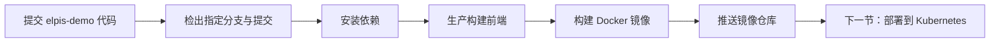

# 持续集成（CI）

<MuxPlayer
  className="mt-8"
  playbackId="2fDcRD5ls00HF8T8MFlkDDYYI9R77j4ttDb4VN00i8m7s"
  title="持续集成（CI）"
/>

> [!NOTE]
> 上一章把 elpis 发布成 npm 包，本节开始部署使用它的业务应用 elpis-demo。课程以 CODING 的构建计划为入口，将检出代码、安装依赖、编译前端、构建 Docker 镜像和推送制品仓库串成一条 CI 流水线。本节结束时得到的是可供部署的镜像；镜像如何在 Kubernetes 中运行，留到下一节完成。

## 从一次手工发布拆出持续集成

先回想没有流水线时怎样发布业务。开发者在本机拉取代码、安装依赖，执行生产构建，拿到模板、JavaScript、CSS 和其他静态资源，再把服务端代码与这些文件一起交给部署人员。部署人员上传、解压、启动服务，最后确认页面能打开。

这个过程并不神秘，问题在于每次都需要人记住步骤。代码来自哪个提交、前端有没有重新构建、依赖装的是哪个版本、包里有没有漏文件，都可能随着一次手工操作而变化。当一个项目反复交付时，把这些操作写成可以重复执行的流程，比每次重新沟通更可靠。

课程以制品仓库作为两段流程的交接点：持续集成负责把源代码变为制品，持续部署负责把指定制品运行到目标环境。两段流程有不同输入、输出，也有各自的日志和失败位置。



这里的 CI 是本课程实际搭建的最小链路。平台还可以运行代码检查、单元测试等阶段，但视频并没有把这些全部配置出来，因此不能把“构建成功”直接解释为“已经通过所有质量检查”。现阶段首先证明：一份已提交的应用代码能够在独立构建环境中转成可部署镜像。

还要分清两个仓库。elpis 框架仓库提供 npm 包，elpis-demo 仓库包含业务入口、业务配置、页面和部署文件。CI 关联的是后者，随后通过 npm 安装前者。如果误选框架仓库，流水线就可能找不到业务启动脚本，或把框架开发工程当成线上应用发布。

## Jenkins、Docker 和镜像仓库各自做什么

课程使用的 CODING 界面把许多 Jenkins 操作包装成可视化阶段。Jenkins 的职责是按配置执行任务：先检出，再执行 shell，再把产物交给后续阶段。它并不会天然理解 elpis 怎样打包，需要我们把本地已经跑通的命令配置进去。

Docker 解决的是交付内容的组织。仅有一份 JavaScript 代码并不足以启动应用，还需要 Node.js、依赖、配置和启动入口。Dockerfile 描述如何把这些内容组织为镜像；镜像被启动后才形成运行中的容器。镜像仓库则负责保存和分发镜像，供下一节的部署流程拉取。

| 对象 | 在本节承担的责任 | 本节需要提供的输入 |
| --- | --- | --- |
| Git 仓库 | 保存可检出的应用版本 | 仓库、分支、提交 |
| Jenkins 构建流程 | 按顺序执行构建任务 | 阶段、构建环境、脚本 |
| Dockerfile | 描述运行镜像怎样组装 | 基础镜像、文件、目录、启动命令 |
| Docker 镜像 | 保存可以被运行的应用内容 | 镜像名称和版本标签 |
| 镜像仓库 | 保存并向部署侧提供镜像 | 目标仓库和推送权限 |

课堂把镜像类比为带运行环境的快照，是为了帮助理解交付边界。严格来说，镜像不等于完整虚拟机，也不等于正在运行的容器。它可以包含应用所需的用户态文件和 Node.js 环境，容器运行还依赖宿主机提供的能力。后续 Kubernetes 管理的是容器工作负载，并不是把一个压缩包直接放到网页服务器上。

## 先创建 beta 构建计划

课程在 CODING 中创建自定义构建计划，名称用 `elpis-demo-beta` 表示测试环境，并关联 elpis-demo 代码仓库。平台提供了现成 Node.js 或 Express 模板，但课程应用使用 Koa，选择空白或自定义流程更容易看清每一步实际执行什么。

最初的检出阶段使用创建计划时配置的仓库信息。接下来新增“编译项目”“构建 Docker 镜像”“推送镜像”几个阶段。它们的先后关系不能随意调整：依赖安装失败时不应继续编译，前端编译失败时也不应拿旧产物构建镜像。

课程是在当时的 CODING 与腾讯云界面中操作。复盘要记住阶段和数据从哪里流向哪里，而不必把按钮位置当成固定接口。比如换一个平台，“构建计划”可能叫“流水线”，“制品管理”可能叫“镜像仓库”，只要仍能完成检出、编译、构建和推送，工程责任就是一致的。

> [!TIP]
> 配置平台时，先把本地已经验证过的命令写下来，再逐条对应到阶段。遇到环境变量、仓库授权或镜像推送参数时，再查平台对应说明。这样可以判断自己缺的是应用构建逻辑，还是平台的某个配置入口。

## 编译阶段复用业务项目自己的命令

视频选择 Node.js 18 作为构建环境。这与 Dockerfile 后面的 `node:18` 相呼应，是本课程演示的环境组合。这里保留录课版本，不把它当成所有项目应长期固定采用的版本建议。

编译阶段主要执行两条命令：安装依赖，然后运行业务应用的生产构建脚本。

```sh filename="CI：编译项目阶段" copy
npm install --production
npm run build:prod
```

前一章已经把前端构建能力封装到框架包中，因此 `build:prod` 仍是 elpis-demo 对外提供的命令。它通过业务根目录的构建入口调用框架 API，扫描页面，生成生产环境的模板与静态文件。CI 不需要重新写一套 webpack 配置，只需要在应用目录中执行已有入口。

视频使用 `--production`，意图是不安装只供本地开发使用的工具，例如 nodemon。这件事必须与上一章的依赖分类配合：**凡是使用方执行构建时实际需要的框架依赖，都必须能在这次安装中获得。** 如果 webpack、Loader 或框架构建所需模块被错误放在不会安装的依赖类别中，本地因为残留 node_modules 可以成功，CI 的干净环境却会失败。

因此，不能机械地认为“CI 都应该只安装生产依赖”。课堂能够这样做，依赖于框架作为包提供构建能力的组织方式；若自己的构建工具只在使用方的 devDependencies 中，就需要先满足构建依赖，再考虑最终镜像中保留哪些内容。判断标准是命令运行的实际依赖关系。

这一阶段结束后，构建工作目录中已经同时存在应用代码、安装好的依赖、生产模板和静态资源。下一阶段 Dockerfile 中的复制动作，复制的正是这个工作目录的内容，而不是开发者电脑里未提交、未上传的文件。

## 用环境变量描述镜像名称、版本和构建位置

课程把 Docker 命令中会变化的部分抽成构建计划的环境变量。这样构建镜像与推送镜像可以引用同一个名称，避免前一阶段打了 A，后一阶段却去推 B。

```sh filename="CI：构建 Docker 镜像阶段" copy
docker build \
  -t "${DOCKER_IMAGE_NAME}:${DOCKER_IMAGE_VERSION}" \
  -f "${DOCKER_FILE_PATH}" \
  "${DOCKER_BUILD_CONTEXT}"
```

这段命令按课堂含义整理，环境变量要在执行它的构建计划中配置。

| 变量 | 课堂中的含义 | 示例 |
| --- | --- | --- |
| `DOCKER_IMAGE_NAME` | 本次构建的镜像名 | `elpis-demo-image-beta` |
| `DOCKER_IMAGE_VERSION` | 区分构建版本的标签 | 分支名与提交 ID 组合 |
| `DOCKER_FILE_PATH` | 用哪一份 Dockerfile | `publish/beta/Dockerfile` |
| `DOCKER_BUILD_CONTEXT` | 允许构建读取的上下文目录 | `.`，即应用工作目录 |

`-f` 与最后的构建上下文是两个不同概念。Dockerfile 可以放在 `publish/beta`，但里面的 `COPY .` 是否能看到应用根目录，由构建上下文决定。如果把上下文误设为 `publish/beta`，构建读取到的可能只有部署配置，业务代码、node_modules 和静态产物都不在可复制范围里。

版本标签采用分支与提交信息，是为了将镜像追溯到代码版本。视频的具体全局变量由平台提供，配置时要确认取到的是实际分支和提交，而不是一段没有展开的字符串。分支名称如果含路径分隔符，也不能原样假定为合法镜像标签；演示中的 `publish-demo` 没有这个问题。

镜像名表示交付哪个应用或环境，版本表示这一次交付是哪份内容。后续排查线上页面没有更新时，必须能把 Git 提交、构建记录、镜像版本和部署记录对应起来，单看一个固定名称是不够的。

## Dockerfile 把构建结果放入可启动环境

课程在业务应用建立 `publish/beta/Dockerfile`。下面将视频中的基础镜像、工作目录、复制、时区、端口和启动命令整理为可读示例。目录名称可按项目调整，示例并非对屏幕源码的逐字还原。

```dockerfile filename="elpis-demo/publish/beta/Dockerfile" copy
FROM node:18

WORKDIR /app/elpis-demo
COPY . /app/elpis-demo

ENV TZ=Asia/Shanghai

EXPOSE 8081
ENTRYPOINT ["npm", "run", "beta"]
```

`FROM` 选择带 Node.js 的基础环境。`WORKDIR` 设置后续运行所处目录，同时让框架读取 `process.cwd()` 时定位到 elpis-demo。这个细节与上一章的 SDK 抽离直接相关：若容器从错误目录启动，业务 Loader 和前端产物定位都有可能偏离。

`COPY` 将构建上下文中的内容复制进镜像。按本节阶段顺序，依赖安装和前端编译发生在镜像构建之前，所以被复制的目录已经包含所需结果。这是课堂采用的简单交付方法；不要误以为此 Dockerfile 自己又执行了一次 `npm install` 或 webpack 编译。

`ENV TZ` 表达课堂设置时区的意图。它与应用选择 beta 配置属于不同维度：前者影响运行环境，后者由启动命令中的环境变量交给框架解析。二者都写在镜像附近，但不能互相替代。

`ENTRYPOINT` 说明容器启动时执行 `npm run beta`。框架最终要跑的是业务应用的 Node.js 服务，而不是 `build:prod`。构建命令生成文件，启动命令监听请求，把两者放错位置，会出现容器执行完一次编译就退出、没有长期运行服务的情况。

> [!IMPORTANT]
> `EXPOSE 8081` 是对容器端口的声明，不会让 Koa 自动改为监听 8081，也不会自动创建公网入口。应用监听端口、Dockerfile 声明以及下一节 Service 的转发端口必须相互对应。

课程随后回到 package.json，把 beta 环境启动端口设为 8081。沿用前面章节的小写环境变量约定，可以整理成下面的形式；入口名使用上一章示例的 `server.js`。

```json filename="elpis-demo/package.json：beta 启动片段" copy
{
  "scripts": {
    "beta": "env=beta port=8081 node server.js"
  }
}
```

这段写法面向课堂流水线里的 Linux shell。Windows 本地可能另有启动脚本，但 Docker 中引用的 `beta` 必须是容器环境能执行的版本。内核读取 `process.env.port`，缺省时使用已有默认端口；现在显式传入 8081，才能与 Dockerfile 保持一致。

## 镜像构建完成，还要把它推到仓库

本地或构建节点上存在镜像，只代表这一台执行机器拥有它。下一节的集群在别的位置运行，不能直接读到 CI 节点的本地镜像，因此还需要推送阶段。

课程先创建 Docker 类型的制品仓库，再回到构建计划，添加推送节点。推送节点使用前面相同的镜像名称和版本，同时配置目标仓库。视频中仓库名称带有临时演示编号，这个编号没有框架层面的特殊意义，不应写死到通用说明里。

从数据关系看，推送阶段至少需要知道两件事：要推哪个本地镜像，推到哪个远端仓库。平台还要具备对应权限。图形化节点可能代办登录、重新标记完整仓库路径和推送等操作，因此不要把界面只填写一个短名称，误解为实际仓库地址也只有这个短名称。

```text filename="镜像名称的对应关系" copy
构建节点里的镜像：
  elpis-demo-image-beta:<本次版本>

远端仓库可供部署拉取的引用：
  <仓库域名>/<项目或仓库路径>/elpis-demo-image-beta:<本次版本>
```

下一节 deployment.yaml 所需要的是远端可拉取的镜像引用。课程后面的镜像地址错误，正是提醒我们不能只凭记忆拼一个名字，而应从制品仓库中的实际记录确认路径和版本。

## 用手动构建观察第一条完整流水线

配置尚未稳定时，课程先关闭自动触发，指定演示分支 `publish-demo`，手动运行一次构建。这是为了让每一步执行和讲解同步。正常使用时可以把指定分支的提交或合并配置为触发条件，不需要每次都回平台点击按钮。

这里有一个容易忽略的顺序：Dockerfile 与 package.json 的端口修改必须先提交到远端。流水线检出的是远端分支，编辑器里尚未提交的文件不会自动出现在构建环境中。同理，选择了错误分支，即使本机改对了，流水线仍会继续使用旧内容。

运行后按照阶段查看日志。安装阶段先确认 npm 是否成功，编译阶段看 webpack 是否完成、产物是否生成；Docker 阶段看基础镜像与复制步骤；推送阶段则看目标仓库和版本。不要只看最后一行“失败”，因为真正需要修复的输入通常在最早出错的阶段。

## 课堂实际故障：远端安装找不到框架版本

第一次运行时，npm 安装阶段出现 404，找不到应用依赖的 elpis 包版本。此时还没有进入 webpack，也没有开始 Kubernetes 部署，问题范围已经很明确：构建环境不能从 npm 获取声明的依赖。

课程解释了演示环境的背景：录课期间反复发布、删除包，应用仍指向一个已不可获得的版本。本地已有 node_modules 可能掩盖这个问题，但 CI 从远端重新安装时暴露出来。课堂重新安装可用版本，更新应用依赖声明，再提交并重新运行构建；后续日志显示新的版本可以取得。

复盘这个错误，不应把所有 404 都归因于“网络不好”，也不应认为永久需要追最新版本。应先确认包名、版本、registry 和该版本是否真实存在，再让应用依赖声明与实际可下载的版本一致。如果项目维护锁文件，也要使声明与锁定结果相互一致，不能只改本机目录就认为远端已经修好。

视频里出现的 1.0.1、1.0.3 是当时的演示版本，没有“今天仍可安装”的含义。课堂的关键证据是：依赖声明修正并提交后，同一条流水线越过安装阶段，继续编译、构建镜像和推送。

| 观察到的失败位置 | 首先检查的输入 | 与本节链路的关系 |
| --- | --- | --- |
| 检出失败 | 仓库权限、分支是否存在 | 构建尚未取得代码 |
| npm 安装 404 | 包名、版本、registry | 框架依赖未准备好 |
| 构建命令失败 | scripts、依赖、页面与配置 | 前端产物尚未生成 |
| Docker 构建失败 | Dockerfile 路径、上下文、文件 | 应用尚未形成镜像 |
| 推送失败 | 目标仓库、镜像名、推送权限 | 部署侧尚拿不到制品 |

这张表是对课堂排错方法的归纳，不表示视频演示了每一种故障。已经实际出现的 npm 404，提供了最重要的方法：根据失败阶段缩小问题范围，再修复这一阶段真实消费的配置。

## 本节小结

本节把 elpis-demo 的人工构建动作移入 CI：从远端检出应用，安装框架依赖，调用已有生产构建命令，依据 beta Dockerfile 组装 Node.js 运行镜像，最后把带版本的镜像推送到制品仓库。

成功的标志有两层：构建记录中各阶段完成，镜像仓库中出现与本次分支和提交对应的镜像。此时应用还没有因此自动获得可访问的公网地址。下一节将从这份镜像出发，配置 Kubernetes 的 Deployment 和 Service，再把新镜像推送事件连接到部署流程，完成从提交代码到在线更新的闭环。
