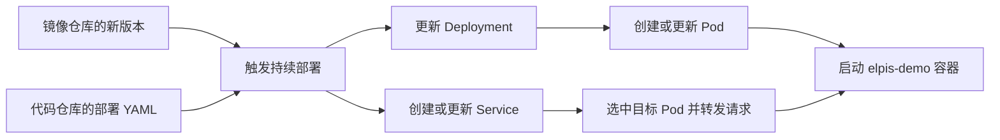
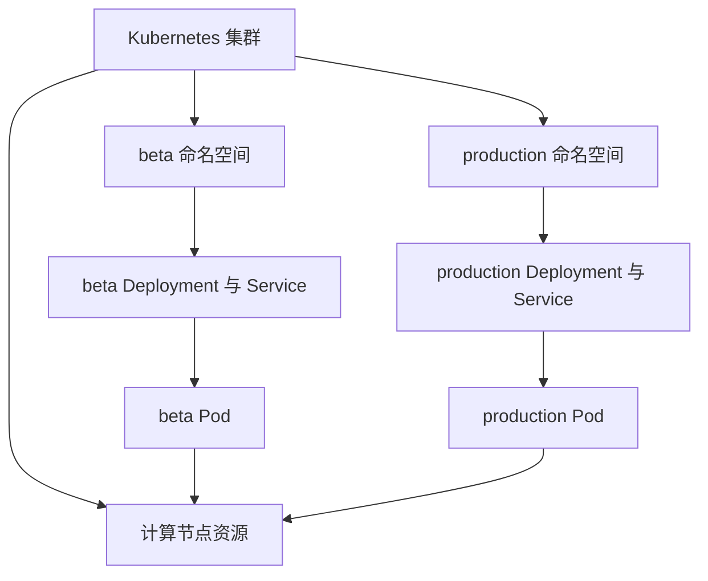
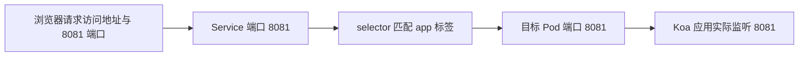
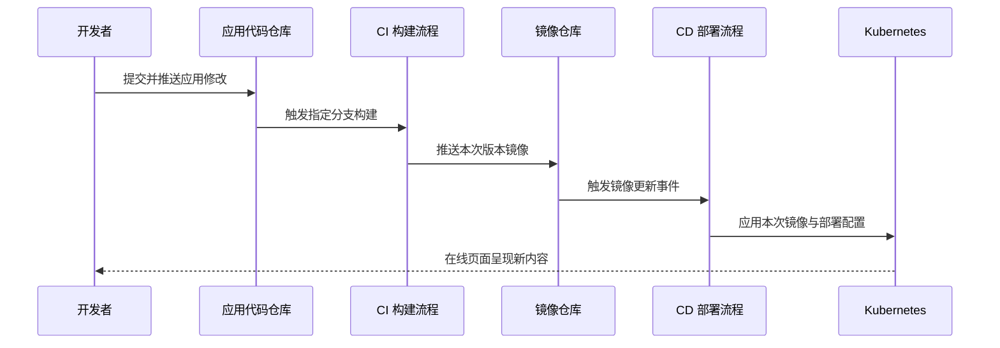

# 持续部署（CD）

<MuxPlayer
  className="mt-8"
  playbackId="tsdkCZJhfg02013ahV01YM5KSaTBh4xFdzRIf7xlVyjUSI"
  title="持续部署（CD）"
/>

> [!NOTE]
> 上一节已经把 elpis-demo 构建为 Docker 镜像并推送到制品仓库。本节从这个制品继续向前：准备 Kubernetes 集群与运行节点，配置 Deployment 和 Service，借助 CODING 的持续部署流程让应用获得访问入口，最后用一次页面文案修改验证“提交代码 → 构建镜像 → 自动部署 → 在线更新”的完整链路。

## 持续部署接过的是镜像和部署配置

本节部署对象仍是业务应用 elpis-demo。elpis 框架已经作为 npm 依赖包含在应用构建结果中，部署侧不需要重新开发一套框架，也不需要再把框架仓库当成运行项目。

上一节的镜像仓库承担交接作用：CI 将代码、依赖、前端产物和 Node.js 运行环境组织成镜像，CD 根据部署配置把指定镜像运行到目标集群。代码仓库保存 deployment.yaml 与 service.yaml，镜像仓库保存应用镜像，两者在部署时共同决定实际结果。



这一步与“上传一个 zip 包，然后在服务器执行启动命令”具有相同的最终目标，但组织方式发生了变化。应用实例由 Kubernetes 管理，外部访问由 Service 等资源连接，部署平台负责把版本变化转换成这些资源的更新。

课程采用 CODING 加腾讯云容器服务完成演示。页面入口、资源规格、计费展示是录课时的平台状态，文档保留其责任关系，不把当时的按钮位置和价格当成固定配置。真正需要迁移到其他平台的，是镜像、工作负载、网络入口和触发规则之间的关系。

## 先把 Node、Pod、Deployment、Service 分清

字幕里多次把 Pod 识别为“POP”，把 Worker 识别为“Walker”，把 Deployment 识别成其他近音词。理解后续配置前，需要把这些词统一回实际资源名称。

Worker Node 是运行工作负载的计算节点，可以由物理机或虚拟机提供。节点上有 CPU、内存、磁盘等资源，Pod 被调度到这些节点上运行。平台中只有一个集群管理入口，并不等于已经有足够的计算节点可以执行应用。

Pod 是 Kubernetes 调度和管理容器的基本单位，可以包含一个或多个紧密协作的容器。本课程的应用 Pod 主要运行一个 elpis-demo 容器。容器由镜像启动而来，因此不能把“镜像文件”“运行中的容器”“Pod”当成同一个对象。

Deployment 描述这类应用工作负载的期望状态，例如用什么镜像、运行多少个副本。它通过控制器管理 Pod 的创建和更新；复盘时可以先理解为“管理这一组应用实例”。课程用它介绍副本扩展和滚动更新，但本次测试配置只有一个副本，并没有完成高可用方案设计。

Service 为一组被选中的 Pod 提供稳定访问方式。Pod 重建后具体地址可能变化，客户端不应该每次都手动查找新的 Pod IP。Service 使用标签选择器找到目标 Pod，再把请求转发到它们的目标端口。

| 概念 | 本课程中解决的问题 | 在控制台中观察什么 |
| --- | --- | --- |
| Node | 应用实际在哪里运行 | 节点存在、资源与可用状态 |
| Pod | 某一次应用实例是否启动 | 调度、拉镜像、容器状态、日志 |
| Deployment | 应用应运行什么版本、多少实例 | 镜像、副本数、更新状态 |
| Service | 请求怎样稳定地到达应用 | 选择器、目标端口、访问入口 |
| Namespace | 哪组环境资源属于同一范围 | beta 与 production 下的工作负载和服务 |

> [!IMPORTANT]
> Service 通过标签选择 Pod，不是通过 Deployment 名称，也不是通过容器名称选择。课堂最后的关键故障就出在这里：外部入口已经出现，但选择器没有匹配 Pod 标签，请求因此无法到达应用。

课堂通过多实例示意解释滚动更新的价值：新旧版本可以分批替换，减少一次性停掉所有实例的影响。但是否能做到用户无感，还取决于副本数量、就绪检查、更新策略和应用行为。本节没有配置这些完整条件，不能仅凭用了 Deployment 就断言更新一定不会中断。

同样，Service 具有流量分发作用，不意味着它默认会统计每个 Pod 当前请求数并总选最空闲的一个。视频用“不同实例承担不同流量”帮助理解负载分配，实际转发行为取决于集群网络和负载均衡实现，复盘不把这个口头例子当成固定调度算法。

## Namespace 组织环境，计算节点提供运行资源

课程为测试环境建立 `elpis-demo-beta` 命名空间。Deployment、Pod、Service 等资源放在这个范围内，后续生产环境可以使用另一个命名空间，使两套环境的资源名称、部署配置和访问入口分别管理。

这里要特别注意层级。Namespace 是许多 Kubernetes 资源的组织范围，Node 是集群级资源，并不隶属于某个 Namespace。测试和生产的 Pod 可以运行在同一批节点上，不能把“两个命名空间”理解为“已经购买了两套独立物理机器”。



图中 Pod 到节点的连线表示运行关系。Namespace 可以让环境资源分别命名与管理，但它自身不自动完成所有网络、权限或资源隔离。本节的目标是先把两套应用配置分开，后面的数据库章节再让不同环境连接各自的数据源。

这也解释了视频中一个真实插曲：已经创建集群、命名空间和部署流程，却发现还缺实际运行节点。控制面的管理能力与工作负载的计算资源是不同部分。只有 YAML，没有可调度的节点，Pod 仍无法正常运行。

## 准备云端连接时，区分几种授权关系

课程先创建腾讯云容器集群，再在 CODING 中关联腾讯云账号，并为持续部署配置可访问该集群的云账号。这些操作看上去都与“绑定”有关，但解决的并不是完全相同的问题。

团队层面的账号关联，使两个平台建立联系；部署流程选择的云账号，使该流程能够访问具体云资源；镜像拉取凭据，则让集群能够从对应镜像仓库取得应用镜像。一个页面显示绑定成功，不代表另一个步骤的资源访问必然已经配置正确。

课程使用平台创建或提供的镜像拉取 Secret 名称，并将它配置到 Deployment。文档只记录它的引用关系，不需要把账户凭据写进 Git。Secret 必须在 Pod 所在的命名空间中可用，且确实具备访问目标镜像仓库的能力。

```text filename="三种连接关系" copy
CODING 团队与腾讯云账号关联
  -> 平台之间建立账号关系

CD 流程选择云账号与集群
  -> 部署平台能够创建或更新集群资源

Pod 引用镜像拉取 Secret
  -> 集群能够从私有镜像仓库拉取镜像
```

视频的云账号绑定调试有较多停顿和字幕重复，无法据此恢复所有页面点击。可确认的结论是：需要分别检查平台关联、流程选择的账号、目标集群与命名空间，以及镜像拉取凭据，不能只在一个“绑定成功”提示上停止排查。

## 把 Deployment 配置放进业务仓库

上一节已有 `publish/beta/Dockerfile`，本节在同一目录增加 `deployment.yaml` 和 `service.yaml`。平台既可以直接填写 YAML，也可以读取代码仓库中的文件。课程选择后者，是为了让部署配置跟随代码版本维护，后续迁移平台时也能复用。

```text filename="elpis-demo/publish 目录" copy
publish/
└── beta/
    ├── Dockerfile
    ├── deployment.yaml
    └── service.yaml
```

下面的 Deployment 根据课堂可确认的字段整理。示例镜像地址、版本与 Secret 名称都是占位值，需要换成自己的制品仓库记录和平台实际凭据名称；它们不是课程账号的真实地址。

```yaml filename="publish/beta/deployment.yaml：关系示例" copy
apiVersion: apps/v1
kind: Deployment
metadata:
  name: ed-beta-deployment
  namespace: elpis-demo-beta
  labels:
    app: ed-beta
spec:
  replicas: 1
  selector:
    matchLabels:
      app: ed-beta-pod
  template:
    metadata:
      labels:
        app: ed-beta-pod
    spec:
      imagePullSecrets:
        - name: coding-pull-secret
      containers:
        - name: ed-beta-container
          image: registry.example.com/demo/elpis-demo-image-beta:build-commit
          ports:
            - containerPort: 8081
```

`metadata.name` 是 Deployment 本身的名称；`namespace` 指定资源放在哪个环境范围中；`replicas: 1` 表示课堂先运行一个应用副本，以完成最小部署链路。

`spec.selector.matchLabels` 要与 `spec.template.metadata.labels` 对应。前者声明这组工作负载选择什么标签，后者给实际创建的 Pod 贴上标签。本例都使用 `app: ed-beta-pod`。这里的字符串只是标签值，叫它“Pod 名称”容易引起误会，因为实际 Pod 对象名称还可能包含控制器生成的后缀。

`containers[].name` 又是容器自己的名称。它与 Deployment 名称、标签值可以相似，但每个字段有独立用途。不要因为名称看着接近，就把一个字段的值复制到另一个字段后假设关系已经建立。

镜像字段必须最终指向上一节推送成功的远端镜像，包括仓库域名、路径、镜像名和所选版本。只写 CI 构建节点上的短名称，或者拼错仓库路径，会导致集群拉取不到镜像。

`containerPort: 8081` 记录应用容器端口，真正的监听仍由上一节 `npm run beta` 传入的端口决定。配置这个字段不会修改 Node.js 程序的监听行为。

## Service 用选择器把入口接到 Pod

Deployment 让应用实例运行起来，Service 则把外部可访问入口与这些实例关联。课程选择 `LoadBalancer` 类型，由云平台提供相应负载均衡入口。它的实际地址与可达性还依赖平台网络资源配置，不能从 YAML 中一个类型名称直接推导出任何环境都必然具有公网地址。

```yaml filename="publish/beta/service.yaml：关系示例" copy
apiVersion: v1
kind: Service
metadata:
  name: ed-beta-service
  namespace: elpis-demo-beta
spec:
  type: LoadBalancer
  selector:
    app: ed-beta-pod
  ports:
    - name: http
      protocol: TCP
      port: 8081
      targetPort: 8081
```

`port` 是 Service 提供的服务端口，`targetPort` 是转发到后端 Pod 的目标端口。课堂把两者都设为 8081，是为了让链路直观；这并不意味着两个字段在所有系统中都必须相同。

`selector.app` 必须匹配 Pod 模板里的 `labels.app`。这个条件才是 Service 知道该把流量交给哪些实例的依据。Service 与 Deployment 放在同一个测试命名空间中，再通过这个标签建立访问关系。



串联到上一节，端口约定跨越了四处：package.json 的启动参数、Dockerfile 的端口声明、Deployment 的容器端口、Service 的目标端口。它们不是同一个配置文件里的重复描述，而是应用启动、镜像说明、工作负载和网络转发不同层次的契约。

## 在持续部署中依次应用两个配置文件

课程在 CODING 的应用中心创建应用，部署方式选择 Kubernetes，再建立 `elpis-demo-beta` 持续部署流程。模板包含部署 Deployment 和部署 Service 两个阶段，分别读取前面两个 YAML。

每个阶段需要确定云账号、代码仓库、分支和文件路径。课堂仍从 elpis-demo 仓库读取，而不是从 elpis 框架仓库读取。分支要包含刚提交的部署文件；如果代码后来从 `publish-demo` 合并到 develop，配置文件来源也要与实际交付策略对应。

| 阶段 | 读取的文件 | 更新的资源 |
| --- | --- | --- |
| 部署 Deployment | `publish/beta/deployment.yaml` | 镜像、Pod 模板与副本 |
| 部署 Service | `publish/beta/service.yaml` | 访问入口、端口与标签选择器 |

配置完毕后，先手动执行一次，便于区分资源配置问题与事件触发问题。执行成功后到集群中观察：Deployment 是否创建，Pod 是否获得节点并启动，Service 是否出现访问地址。最后访问实际页面，而不是只把“流程执行结束”当成应用可用的唯一证据。

这一阶段课堂还补建了运行节点。视频先尝试一种节点池方式，再调整为实际需要的节点类型，期间也处理了演示资源删除保护和费用问题。复盘应抓住原因：**存在节点池配置或集群对象，不等于已有可用节点在执行 Pod。** 具体节点类型与规格是平台选择，不能从字幕中的试错过程推导出所有平台都要采用相同按钮路径。

云资源可能分别计费，删除一个实验性配置也未必等于所有关联资源都被释放。课程在试错后清理了不再需要的资源，这属于本次演示的收尾动作。这里不复述录课时的充值金额与单价，也不将它们作为今天的成本估计。

## 调试一：镜像拉不到时，先确认应用是否启动过

课堂中出现过镜像地址配置不正确，导致部署侧无法取得镜像。这个阶段应用容器尚未成功运行，因此看不到业务日志，并不说明 Logger Loader 或接口代码一定有问题。

应先回到镜像仓库，确认本次版本实际存在，再核对 deployment.yaml 或部署流程最终选中的镜像引用。仓库路径、镜像名、标签以及访问凭据，都处于这个故障范围内。若镜像地址少了一段路径，反复重启 Pod 也不会把错误地址变成正确地址。

同时要分清 CI 推送权限与 CD 拉取权限。构建节点能够推送，不代表运行节点已经具备拉取权限；这是不同执行主体在不同阶段访问同一仓库。课程使用的云账号和镜像 Secret，就是为了把这两边的访问关系连接起来。

字幕在这一段有较长重复，因此不能把中间每次检查都写成已经证实的修复。可以确认课程最终把问题归纳为云账号、镜像地址和 Service 配置三类；其中最后一类有完整的定位、修改和页面成功验证。

## 调试二：入口有了，为什么请求没有进入 Pod

后段的现象更有代表性：Service 已显示访问 IP 和端口，Pod 看上去也已经启动，但浏览器访问不成功。讲师回到 Pod 查看日志，发现访问多次后日志仍没有新增请求记录，于是开始检查 Service 与 Pod 的连接关系。

此时不能再把所有问题都归到 npm 或镜像构建。镜像已经取得，应用有启动迹象，失败边界已经向网络转发移动。检查 Service 配置后，发现选择器使用的标签值没有与 Deployment 的 Pod 模板保持一致。

```yaml filename="选择器错误与修正的对照" copy
# Pod 模板实际设置的标签
labels:
  app: ed-beta-pod

# 错误：没有匹配上面的 Pod 标签
selector:
  app: ed-beta

# 修正：与 Pod 模板中的标签值保持一致
selector:
  app: ed-beta-pod
```

上面是对照片段，不是一份可以整体直接应用的 YAML；同一资源中只应保留对应位置的正确配置。课堂口头把这些值称为“名称”，但真正控制匹配的是标签键和值。

修复后的操作顺序也值得保留：修改 service.yaml，提交到远端，重新执行持续部署，让 Service 资源得到更新，再访问原来的入口。浏览器随后正常打开应用。这个结果把“选择器不匹配”与“请求没有进入 Pod”的因果关系连接起来。

> [!TIP]
> 排查部署时，要把“容器还没有启动”与“容器已经启动，但请求没有送到它”分开。前者优先看调度、镜像和启动错误；后者优先看 Service 标签、端口和网络链路。日志没有新增只是线索，需要结合 Pod 状态一起判断。

视频排查期间也检查了公网和安全组等配置，但最终这次访问问题是通过修正 Service 选择器解决的。不能因此把“给每个 Worker 都开公网”写成固定前置条件，更不能把课程中临时尝试的网络配置作为已经证实的根因。

## 把新镜像事件接到持续部署

手动部署成功后，课程为 CD 流程添加镜像仓库触发器。含义是：目标仓库中对应镜像有新版本推送时，启动这条部署流程。与此同时，CI 恢复指定代码更新事件触发，形成两个前后衔接的自动化动作。



触发器只负责启动流程，仍必须确保本次事件对应的镜像版本被用于部署。若 YAML 永远写着一个旧标签，触发器再勤快，也不等于新版本一定被发布。平台可能通过制品绑定或镜像替换机制将本次制品注入 Deployment；应检查最终部署记录和工作负载里的镜像版本是否一致。

字幕没有完整呈现平台替换镜像标签的表达式，因此本文不杜撰一段 `${...}` 语法。前面的 YAML 使用显式版本占位，帮助说明最终应是什么值。自动化配置的验证标准是：触发此次 CD 的制品，确实成为此次 Pod 使用的镜像。

## 用一次可见修改验证完整闭环

课程最后在项目列表页面上把文案改为“elpis 项目列表”，然后提交并推送到已经配置触发规则的分支。这是一个很好的端到端验证样例：变化足够小，却可以明确区分新旧版本。

先看到 CI 构建计划自动启动，执行安装、编译、镜像构建和推送；随后在制品仓库看到新记录；再看到 CD 自动开始，更新 Deployment 与 Service；最后刷新云端页面，确认新文案已经出现。

这个顺序将多个容易混淆的“成功”串联起来。Git 推送成功只说明代码到了仓库；CI 成功说明镜像生成并推送；CD 成功说明部署动作完成；页面显示新内容，才说明预期业务变化已经通过整个链路到达可访问环境。

| 观察位置 | 应出现的变化 | 它证明了什么 |
| --- | --- | --- |
| Git 提交记录 | 包含新页面文案的提交 | 源码已进入目标分支 |
| CI 构建记录 | 对应提交的成功构建 | 已生成并推送新制品 |
| 镜像仓库 | 本次版本的镜像记录 | 部署侧有可拉取的新输入 |
| CD 与 Deployment | 使用新版本的部署记录 | 工作负载已接收本次发布 |
| 在线页面 | 出现修改后的文案 | 完整链路的业务结果可见 |

以后日常交付主要通过提交和合并触发，重复安装、打包、上传、重启的动作由流程执行。基础设施维护仍然存在，例如节点资源、故障处理和容量评估；自动化减少的是重复发布操作，并没有消除运行服务所需的管理责任。

## 从 beta 推导 production 的独立配置

课程完整演示 beta，并要求进一步配置 production。测试环境使用 8081，生产环境练习使用 8082。这个要求是在检验是否理解了配置之间的关系，而不是把目录复制一次、只改一个名称就结束。

| 配置位置 | beta 示例 | production 需要对应调整 |
| --- | --- | --- |
| 启动脚本 | beta 环境、端口 8081 | production 环境、端口 8082 |
| 部署文件目录 | `publish/beta` | 独立的生产部署目录 |
| Dockerfile | 启动 beta 脚本 | 启动生产脚本并声明相应端口 |
| Namespace | `elpis-demo-beta` | 独立的 production 命名空间 |
| Deployment | beta 名称、标签、镜像 | 使用生产对应的配置与镜像 |
| Service | beta 标签与目标端口 | 匹配生产 Pod 和 8082 端口 |
| CI 与 CD | beta 的构建和部署流程 | 生产环境对应的独立流程 |

镜像仓库可以分别建立，也可以在同一个仓库中用不同镜像名区分，关键是两套触发器和镜像选择关系清晰。不能让 beta 的新制品误触发 production，或让生产 Deployment 拉到测试环境的镜像。

两套命名空间可以共用节点，但各自工作负载、服务、启动环境和后续数据库配置应独立维护。课程此时尚未完成生产数据库配置，因此这里只建立环境边界，不提前编造数据库地址和连接参数。

## 本节小结

本节从镜像仓库出发，建立了 Kubernetes 运行资源和访问资源的关系：Pod 在 Node 上运行容器，Deployment 管理应用实例，Service 通过标签选择器将请求转到应用监听端口，Namespace 组织不同环境的资源。

课堂最重要的调试结果，是把“有入口但访问不到”定位到 Service 与 Pod 标签不匹配。修复并重新部署后，再连接代码提交触发 CI、镜像推送触发 CD，最终以在线页面文案变化验证闭环。至此，elpis 从本地框架开发、npm 包消费，走到了可以持续交付业务应用的部署链路。
