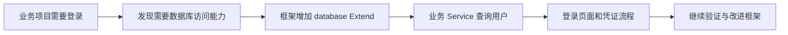
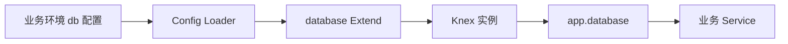
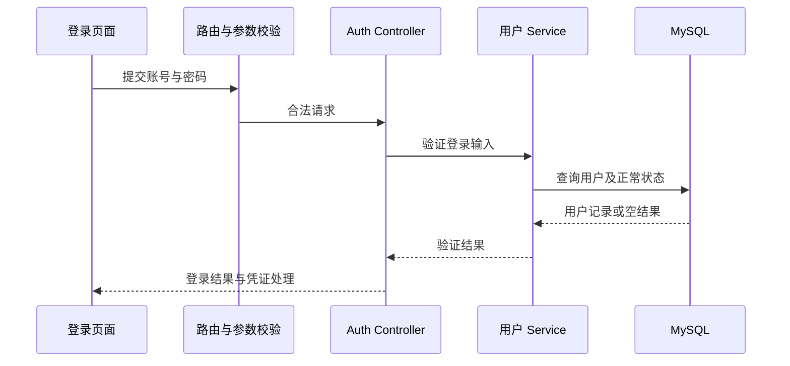

# 登录功能

<MuxPlayer
  className="mt-8"
  playbackId="tw01j45f8yb4hdZUBEjpJtPW1ifATDgVEBWZ6Lgr500kQ"
  title="登录功能"
/>

> [!NOTE]
>
> 这一节开始用已经完成的 elpis 框架开发实际业务，先实现 **登录功能**。课程从数据库准备入手，建立用户表，通过 Knex 接入 Node.js，再增加登录页面、账号查询和登录凭证配置。
>
> 重点不只是把登录表单写出来，还包括判断哪些能力应该沉淀到框架：数据库连接可以作为通用 Extend 暴露，账号字段、用户状态和登录页面则由业务项目维护。
>
> 课堂使用简单账号和密码数据演示端到端链路，并配置 JWT secret。本文保留这一教学过程，同时明确：演示中的明文密码、直接写入配置的连接凭据并不是生产环境的密码存储和密钥管理方案。

## 用实际业务检验框架是否好用

前面几个里程碑已经完成内核、工程化、模板和组件能力，但框架是否便于使用，仍然要通过真实应用来验证。

本节从登录场景出发，开发者身份从“写框架”切换为“使用框架写业务”。当业务需要数据库，而框架还没有统一入口时，就反过来补充框架能力；当登录页面需要账号规则时，则留在业务侧实现。



这种反馈关系很重要。框架的第一版不可能预先覆盖全部业务，实际使用过程中发现共性、调整边界，才会让后续能力更加稳定。

课程并不在这一节系统讲解数据库全部知识，而是让已有前端经验的学习者具备创建表、连接数据库、查询数据并用于业务的基本能力。

## 数据库实例、库、表和记录的层次

课堂使用腾讯云上的 MySQL 实例，演示 MySQL 8.0 与 InnoDB 环境下的基础操作。视频里的购买界面和价格属于录制时场景，复盘不把当时价格作为当前费用说明。

理解结构时，老师用文件夹与 Excel 作类比：一个库类似用于分类的文件夹，一张表类似结构固定的表格，字段对应列，一条用户数据对应一行。

```text filename="数据库层次示意" copy
MySQL 实例
└── elpis_beta 数据库
    └── t_user 用户表
        ├── 字段定义
        └── 用户记录
```

这个类比用于建立直觉。数据库的列不仅有标题，还规定类型、是否允许为空、主键和其他约束；查询也不是随意编辑单元格，而是通过 SQL 或数据访问工具执行。

课堂先建立测试环境数据库。生产环境与测试环境应使用各自配置，避免调试数据和真实数据混在一起。

## 用户表先建立唯一标识

第一列是 `id`，作为表中一条记录的主键，使用整数类型并设置自增。插入记录时，不必手工填写这个字段，数据库按规则产生值。

随后增加 `user_id`，用于业务层的用户标识。课堂用 UUID 演示，和数据库内部自增 ID 分开。

| 标识 | 本节用途 |
| --- | --- |
| `id` | 数据库记录主键，便于内部定位 |
| `user_id` | 业务用户标识，供业务关联使用 |

自增 ID 往往可以被推测，暴露给外部也可能让人估算数据规模。使用另一个业务标识可以减少这类直接暴露，并为后续数据组织保留空间。

但不透明 ID 不能代替权限校验。即使用户标识难以猜测，服务端也必须检查当前请求者是否允许访问目标用户的数据。

课堂界面中整数类型后面填写的显示宽度，也不能理解为改变了 BIGINT 的实际存储范围；理解字段时，应优先关注类型、约束与用途。

## 按登录与展示需求补齐字段

用户表继续增加账号、密码、昵称、性别、描述、状态和时间字段。

```text filename="用户表字段职责示意" copy
id            数据库自增主键
user_id       业务用户唯一标识
username      登录账号
password      课堂演示的密码字段
name          页面展示昵称
sex           业务中的性别编码
description   用户说明
status        记录状态
create_time   创建时间
update_time   更新时间
```

账号与展示昵称不同。用户可以使用一个稳定账号登录，界面上显示另一个昵称。密码字段属于验证输入，不应跟昵称、描述一起返回给前端展示。

课堂用 VARCHAR 表达字符串，用整数表达枚举状态，用 DATETIME 表达时间。字段长度与是否允许为空应由业务含义决定，不是所有列都机械地采用同一设置。

创建时间通常需要在新增时产生，更新时间可以在尚未发生修改时为空。描述等非必要展示信息允许缺省，账号和身份字段则需要明确约束。

## 用 status 表达逻辑删除

课程增加状态字段，并用正常状态与删除状态区分记录是否参与正常业务。

删除时可以直接移除整条记录，这叫物理删除；也可以仅修改状态，让常规查询不再返回它，这叫逻辑删除。

```text filename="课堂状态示例" copy
status = 1   正常记录
status = -1  已逻辑删除
```

逻辑删除保留原记录，有利于排查历史变化，但正常查询必须记得过滤状态。登录尤其如此：账号和密码即使匹配，如果用户已经停用或删除，也不应继续进入系统。

这不是说任何业务都应该永远保留数据。这里讲的是状态字段的实现方式，实际数据保留期限和删除策略仍由具体应用决定。

后面 Service 查询用户时会把正常状态纳入条件，这让表设计与业务规则形成对应。

## 插入样例用户只是验证准备

表结构完成以后，课堂通过控制台插入一个示例管理员用户，观察控制台生成的 INSERT 语句，以及自增 ID 自动出现的结果。

这个操作帮助理解：在图形界面中填表，最终仍会转成数据库执行语句。框架以后通过 Node.js 写入数据，也是把输入转换成明确的数据操作。

视频使用简单固定密码以方便联调。本文不复写视频中的账号密钥作为可部署默认值，配置示意也使用环境变量和占位说明。

> [!IMPORTANT]
>
> 课堂用明文密码字段演示查询链路，不能把“查询 username 和 password 相等”直接用作生产登录方案。真实应用应保存适合密码存储的带盐哈希，并在服务端验证；数据库连接密码和 JWT secret 也不应进入前端资源或公开仓库。

这一点属于当前登录实现的直接边界，而不是额外改变课程架构。后面仍按课程的 Router、Controller、Service 分层来理解流程。

## 数据库连接参数由环境配置提供

连接数据库需要知道主机、端口、库名、账号和密码。课堂先在 default 配置中定义 db 结构，再用 beta、local 等环境配置覆盖实际连接值。

```js filename="config 中的数据库配置示意" copy
module.exports = {
  db: {
    client: 'mysql',
    connection: {
      host: process.env.ELPIS_DB_HOST,
      port: Number(process.env.ELPIS_DB_PORT || 3306),
      database: process.env.ELPIS_DB_NAME,
      user: process.env.ELPIS_DB_USER,
      password: process.env.ELPIS_DB_PASSWORD,
    },
    pool: {
      min: 5,
      max: 20,
    },
  },
}
```

这段代码按课堂连接结构整理，用环境变量代替视频里直接填入的演示值。连接池范围沿用课堂的示例含义，不代表适用于所有数据库规格与部署数量。

一个服务进程拥有自己的连接池，多进程或多个实例同时运行时，总连接数会累加。因此参数应根据数据库能力与应用规模调整。

课堂本地环境暂时连接测试库，生产配置尚未接入。环境 Loader 会合并默认配置与当前环境配置，这正是前面内核能力在实际业务中的使用。

## 通过 Knex 组织数据库操作

Knex 是本节引入的数据访问工具。它根据连接配置建立数据库访问能力，并用链式 API 表达查询、插入和更新等 SQL 操作。

```js filename="Knex 使用关系示意" copy
const knex = require('knex')
const database = knex(dbConfig)

const users = await database('t_user')
  .where({ status: 1 })
  .select('user_id', 'username', 'name')
```

业务代码描述要查哪张表、满足什么条件、返回哪些字段，工具负责把这些内容组织成数据库查询。

字幕把注入问题口述成 XSS，这里应区分：数据库语句拼接对应的是 SQL 注入；网页内容执行对应的是 XSS。使用查询构造器与参数绑定可以减少直接拼接 SQL 的风险，但如果仍把用户输入拼进 raw SQL，就不能仅凭用了 Knex 认为安全问题已经消失。

课程的重点是把数据库操作语义化，并接入已有框架服务层，不需要在 Controller 中散落连接细节。

## database 应该沉淀为框架 Extend

数据库连接本身具有通用性。多个业务模块都可能查询数据库，如果各自在 Service 中初始化连接，就会重复代码，也难以统一管理配置与连接池。

所以课堂在 elpis 内增加 `database` 扩展，读取 db 配置并返回初始化后的 Knex 实例，供业务通过 `app.database` 使用。

```js filename="框架 database Extend 示意" copy
module.exports = (app) => {
  const dbConfig = app.config.db
  if (!dbConfig) return undefined
  return require('knex')(dbConfig)
}
```

具体导出形态应与前面 Extend Loader 的约定一致。关键链路是：业务提供环境配置，框架按配置初始化，运行时统一暴露数据库入口。



配置不存在时如何处理，要看项目是否要求数据库必备。示意保留课堂“按配置决定是否创建”的思路，具体业务启动仍应对必需能力缺失给出清楚反馈。

## 框架与业务的改动通过本地链接联调

此时 elpis 已经是可以被业务项目依赖的包。开发数据库扩展时，如果每改一行框架代码都发布版本、再到应用安装一次，反馈会非常慢。

课堂使用前面讲过的本地链接方式，让示例项目直接使用正在修改的框架。这样业务运行中发现问题，可以马上回到框架修复并验证。

同时也出现一个典型问题：在业务项目重新安装依赖后，本地链接可能被安装结果替换，运行的又变成已发布版本。表现上像是“框架明明改过，页面仍然没变化”。

因此排查时要确认应用实际加载的是哪一份包。代码所在目录、依赖解析结果与当前链接状态，比只看编辑器里打开了哪个文件更可靠。

## 错误提示可能只描述了 catch 的一种原因

启动时，课堂遇到“找不到 default config”之类提示，但文件实际存在。继续定位输出位置，发现这条消息来自加载配置的 catch。

catch 不只会捕获文件不存在，也会捕获配置文件执行时的语法错误。打印真实异常后，课程发现新增 db 配置处缺少逗号。

```js filename="配置加载错误信息改进示意" copy
try {
  const defaultConfig = require(defaultConfigPath)
  // 后续配置合并
} catch (error) {
  console.error('加载默认配置失败：', error.message)
  throw error
}
```

示意强调保留原始错误原因。不要把所有异常都压成“文件不存在”，否则信息会误导下一次排查。

课堂也没有停留在临时打印后修掉逗号，而是回头调整框架错误描述。业务联调不仅发现业务问题，也会暴露框架诊断能力不足的地方。

## 登录页面属于业务项目

数据库能力就绪以后，课堂创建 auth 页面及登录子视图，并用框架导出的 boot 初始化入口。

```text filename="登录页面组织示意" copy
业务前端目录
├── entry
│   └── auth.js
└── pages
    └── auth
        ├── auth.vue
        └── complex-view
            └── login
                └── index.vue
```

Auth 外层放 router-view，登录表单对应内部 login 路由。这样的入口以后还可以承接其他认证相关页面，而不会混入 Dashboard 的业务模块。

```vue filename="auth.vue：页面外层示意" copy
<template>
  <router-view />
</template>
```

登录表单提供账号、密码和提交入口，事件交给业务请求层处理。框架提供启动、请求和组件基础能力，但不决定某个业务要使用什么账号规则或登录展示样式。

## 从表单到用户查询的分层

本节登录链路沿用已有 API 开发方式：接入层定义参数，Controller 组织登录动作，Service 读取用户表，再根据结果生成成功或失败响应。



课堂简化查询同时使用 username、password 与正常 status 条件。复盘应理解其数据流，同时认识到密码验证在真实应用中需要独立的安全存储与比较机制。

下面只展示状态与账号查询，不把明文密码比较伪装成完整可部署实现。

```js filename="用户读取职责示意" copy
async function findActiveUser(database, username, normalStatus) {
  return database('t_user')
    .where({ username, status: normalStatus })
    .first()
}

// 登录 Service 在服务端继续执行密码验证。
// 实际密码字段、哈希验证器和失败策略由应用明确实现。
```

## 把业务状态值集中管理

如果 Service 中到处直接写 `status: 1`，后面读代码时很难判断这个数字是什么意思。课堂因此在业务 Extend 中增加状态枚举，用 NORMAL 表达正常状态。

```js filename="业务状态常量示意" copy
module.exports = {
  NORMAL: 1,
  DELETED: -1,
}
```

这里再次体现框架与业务的边界。数据库连接工具可以通用，而状态 1、-1 的业务含义由当前应用定义，不必写死在框架数据库扩展内部。

Service 使用同一份枚举过滤正常用户，后续用户管理也可以复用，减少多个模块各写一套数字含义的风险。

## 登录成功后建立凭证与展示信息

课程最后配置 JWT secret，并完成可进入系统的登录流程。结合下一节继续使用的状态，可以明确两类信息：Token 放在 Cookie 中用于后续请求校验，用户展示信息写到本地存储用于界面显示。

这两者不能混为一谈。localStorage 中的用户名可以被用户修改，只适合展示；服务端判断是否登录，需要验证 Token，而不能相信浏览器传来的昵称。

```text filename="登录后状态的职责" copy
Cookie 中的 Token
  → 后续请求的登录凭证载体
  → 下一节由服务端中间件验证

本地存储中的用户展示信息
  → 头像、昵称等界面内容
  → 不作为权限与身份判断依据

JWT secret
  → 服务端签发与验证所需配置
  → 不进入浏览器构建资源
```

本节字幕后半存在较长重复识别，不能可靠还原全部 Token 签发参数和 Cookie 选项，因此不提供声称与课堂逐字一致的签发源码。下一节会围绕已存在的 Token 继续完成校验与退出链路。

## 登录成功后的返回位置

登录页需要区分主动进入登录与因为访问受保护页面而被跳转过来。

没有回调目标时，可以进入项目列表；带有 callback 时，登录成功后回到原先想访问的位置。下一节登录校验中间件会生成这类回调参数。

callback 是导航输入，不能无条件信任。实际应用应限制为同源、允许的相对路径，避免把任意外部 URL 当成登录成功后的跳转目标。

```text filename="登录完成后的导航关系" copy
主动登录 → 项目列表
访问受保护页面被拦截 → 登录 → 经过校验的 callback 页面
```

本节先建立登录的基础行为，后续会通过删除 Cookie 和重新登录来验证这一闭环。

## 页面联调也在检验打包后的框架入口

课堂登录页运行时还遇到入口配置、页面注入对象、资源地址与本地链接等问题。它们说明“把框架源码跑起来”和“从业务包正确消费框架”是两种不同的验证。

遇到路由无法匹配，先检查 auth 入口与内部 login 路由；遇到配置字段 undefined，检查服务端注入到页面的对象名和读取方式；遇到 logo 404，检查业务 public 目录与静态资源路径。

依赖重新安装以后，还要确认当前页面使用的是本地更新后的框架包。不能把旧包行为归因于刚修改的源码没有生效。

这些问题没有改变登录业务本身，却会阻断整个应用运行，所以项目实践必须同时观察业务链路与框架接入链路。

## 本节小结

本节以登录为第一个业务场景，建立用户表，连接 MySQL，并通过 Knex 和 database Extend 把数据库能力接入框架。字段设计包含内部主键、业务用户标识、账号、展示信息、状态与时间，登录查询需要考虑正常状态。

业务侧新增 Auth 页面与登录流程，使用框架提供的启动、请求和服务分层能力。数据库访问沉淀进框架，用户状态与页面规则保留在业务项目中，本地链接帮助两边同步迭代。

课堂演示完成了登录与凭证基础配置，但明文密码和直接填写密钥只用于教学链路。下一节继续实现 Token 校验、退出登录，并把头部用户面板进一步开放给业务自定义。
