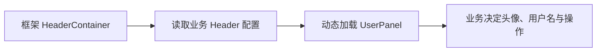
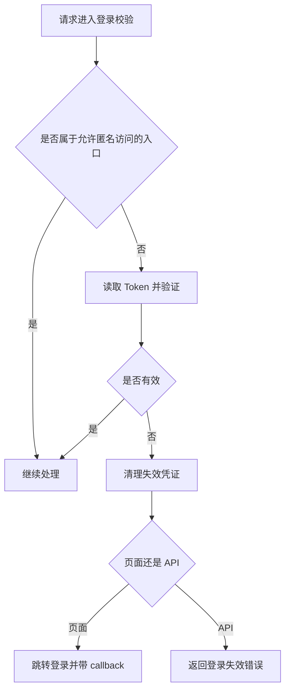

# 登录校验及登出功能

<MuxPlayer
  className="mt-8"
  playbackId="C1QLJN61VOEW1LEFEXmeZixNHzZQBZsF2aJ3wi5B5zg"
  title="登录校验及登出功能"
/>

> [!NOTE]
>
> 上节课已经完成登录页面、用户查询和凭证基础配置，本节补齐 **登录校验与退出登录**。服务端要验证后续请求携带的 Token，未登录时分别处理页面请求和 API 请求，退出时清理浏览器中的登录凭证。
>
> 课程还借这个业务场景改进框架：把 HeaderContainer 中写死的用户名、头像与退出菜单抽到业务 UserPanel，通过配置加载；把 API 签名白名单开放为业务配置，而不是把特殊路由写死在框架中。
>
> 本节的重点是两条闭环：框架如何承接业务扩展，以及登录、受保护请求、失效反馈、重新登录和退出如何连起来。Cookie 清除、Token 验证、API 签名与界面展示是不同职责，不能相互替代。

## 先发现 HeaderContainer 中的业务耦合

前面为了快速完成公共头部，HeaderContainer 内直接写了头像、固定用户名与退出登录菜单。现在进入真实业务，用户名需要来自登录结果，菜单也可能包含个人资料、系统设置或其他应用特有功能。

如果继续把所有这些操作写进 elpis，框架会不断认识具体业务。换一个项目就要修改框架用户面板，复用边界也会越来越模糊。

课堂因此先处理这个问题：框架保留用户区域的位置与加载机制，具体面板由业务项目提供。



这不是推翻之前的公共容器，而是在真实使用中把变化部分进一步移出去。框架第一版已经验证了布局，现在补足业务扩展入口。

## 业务侧建立自己的 UserPanel

课堂在业务项目的 widget 目录中建立 HeaderContainer 扩展目录，再创建专属 UserPanel 子视图。

```text filename="业务用户面板组织示意" copy
业务前端目录
└── widget
    └── header-container
        ├── header-config.js
        └── complex-view
            └── user-panel
                ├── index.vue
                └── assets
                    └── avatar.png
```

原来框架中的模板、脚本、相关样式与头像资源一起迁移到业务面板。只搬事件而留下图片和样式，会造成组件仍然依赖原目录，边界并没有真正清楚。

这里沿用前面 Search Item、Form Item 等扩展配置的思路：业务声明自己提供什么组件，框架按照统一协议加载它。

## 用配置描述需要加载的组件

业务 Header 配置引入 UserPanel，并以约定字段导出。

```js filename="业务 header-config.js：按课堂思路整理" copy
import UserPanel from './complex-view/user-panel/index.vue'

export default {
  userPanel: {
    component: UserPanel,
  },
}
```

框架通过构建阶段的业务别名找到这份配置，再在头部区域渲染动态组件。

```vue filename="框架 HeaderContainer 动态面板示意" copy
<component
  v-if="businessHeaderConfig.userPanel"
  :is="businessHeaderConfig.userPanel.component"
/>
```

这样业务不配置 userPanel 时，框架可以不显示该区域；配置以后，显示内容完全由业务组件控制。

动态组件本身只是手段，真正的扩展协议包括三部分：业务文件放在哪里、框架如何找到它、配置对象以什么字段提供组件。缺少其中任何一部分，都无法形成稳定接入方式。

## 构建别名连接框架与业务目录

框架代码无法写死每个应用的绝对路径，所以课堂在 Webpack base 配置中增加业务 Header 配置的别名，指向当前业务项目的 `header-config.js`。

```text filename="配置定位关系" copy
框架中的业务配置 import
  → 构建别名
  → 当前业务项目的 header-config.js
  → 当前业务 UserPanel
```

它和之前的表单、搜索项扩展入口具有相同结构。每一种扩展不必重新发明一套加载方式，只需要补充明确的配置入口。

调试时，课程修改业务面板中的显示名，确认页面立即反映变化；再移除 userPanel 配置，确认该区域消失。这两步分别证明组件来自业务侧，以及框架对可选配置有响应。

## 用户名从登录后的展示信息读取

面板拆出来后，固定用户名也要移除。上节登录成功后已将用户展示信息写入 localStorage，本节在 UserPanel 中读出名称，缺省时显示“管理员”。

```js filename="UserPanel 展示信息读取示意" copy
function readDisplayName(storageKey) {
  const raw = window.localStorage.getItem(storageKey)
  if (!raw) return '管理员'

  try {
    const user = JSON.parse(raw)
    return user.name || '管理员'
  } catch {
    return '管理员'
  }
}
```

代码是整理后的读取示意，实际存储 key 与值结构必须和登录页写入时一致。若原项目只保存字符串，就不应再按对象解析。

本地存储只用于界面展示。用户可以修改它，旧信息也可能在 Token 失效后继续存在，因此右上角显示某个名字不能证明服务端仍然认为用户已登录。

登录判断以请求携带的凭证及服务端验证结果为准。

## 退出登录先确定服务端动作

课程随后新增 logout 路由。当前登录凭证放在 Cookie 中，退出时的主要动作是把对应 Cookie 清空并设置为过期，再跳转回登录页面。

因为没有额外数据库操作，课堂没有为了形式完整强行新增 Service。Controller 处理当前请求和响应即可。

```js filename="退出登录 Controller：逻辑示意" copy
async function logout(ctx) {
  ctx.cookies.set('token', '', {
    expires: new Date(0),
    path: '/',
  })

  ctx.redirect('/auth#/login')
}
```

Cookie 名称与登录页地址按教学链路示意。实际删除时，name、path、domain 等需要和设置时一致，否则浏览器可能保留原有 Cookie。

这里不必先读出 Token 才能清理。无论当前有没有值，服务端都可以发送对应的过期 Set-Cookie，让浏览器移除该凭证。

## Token 与 Cookie 不是同一个概念

课堂特别说明，Token 是令牌内容，可以放在 Cookie、localStorage 或其他载体中。当前方案使用 Cookie，因此退出动作针对的是这个载体中的值。

清除当前浏览器的 Cookie，意味着后续正常请求不再自动携带它，但并不等于已经签发的 JWT 在服务端被立即撤销。

如果一个 Token 在其他地方已有副本，单纯清本地 Cookie 无法让副本自动失效。需要“立即撤销所有副本”的业务，应另外设计服务端会话或撤销机制；本节没有完成这一层能力。

UserPanel 也可以同步清除本地展示信息，避免退出以后仍显示旧名字。展示清理与凭证清理是两个动作，不能只做其中一个就认为完整退出链路已经验证。

## 浏览器导航与 Ajax 请求的差异

课堂从 UserPanel 处理退出命令，通过 `window.location` 直接导航到 logout 地址。这样服务端返回 302 时，浏览器会把当前页面跳到登录页。

```js filename="UserPanel 退出事件示意" copy
function handleUserCommand(command) {
  if (command !== 'logout') return
  window.location.href = '/api/auth/logout'
}
```

如果改用 fetch 或 Axios 请求，同样可能在网络层跟随重定向，但并不会因此自动把浏览器顶层页面导航到登录页。那种实现需要接口返回结果，再由前端显式执行跳转。

所以差异在于请求方式对应的浏览器行为，而不是“POST 不能重定向”或“API 无法出现 302”。课堂选择页面导航，是为了让服务端直接控制当前页面的退出落点。

本节复盘保留这一演示方式，不把它混成另一条 Ajax 登出流程。

## 页面导航不能携带自定义签名请求头

直接修改 window.location 发起的是浏览器导航，无法像现有请求封装那样先计算并设置自定义签名请求头。

但 logout 位于 `/api` 路径下，原有 API 签名中间件会按通用规则校验，导致退出请求被拦截。

课堂在这里再次调整框架：给签名中间件增加可配置白名单。某些明确允许直接导航的路径，可以跳过这一项签名检查。

```js filename="业务签名白名单配置示意" copy
module.exports = {
  apiSignVerify: {
    whiteList: ['/api/auth/logout'],
  },
}
```

字段名按课堂含义整理，项目实际配置应与中间件读取处一致。使用精确路径匹配，避免因模糊匹配把更多接口意外纳入例外。

## 白名单属于中间件配置协议

框架中间件读取 `app.config`，在进入签名校验前判断当前路径是否在白名单中。

```js filename="签名中间件可配置入口示意" copy
module.exports = (app) => async (ctx, next) => {
  const whiteList = app.config.apiSignVerify?.whiteList || []

  if (whiteList.includes(ctx.path)) {
    await next()
    return
  }

  // 继续执行前面已实现的请求签名校验。
  await verifyRequestSignature(ctx)
  await next()
}
```

`verifyRequestSignature` 是说明性占位，代表已有实现。业务只声明例外路径，框架不认识某个项目具体有哪些退出、回调或公开接口。

这也是通用中间件的配置模式：稳定处理流程放框架，允许变化的参数从业务配置读取。以后错误信息、规则参数等也可以沿同样方式开放，但需要为每个选项写清含义。

## 签名例外不等于取消登录保护

这里的白名单只跳过 API 签名中间件的一项检查，不应被理解为同时绕过登录、权限或所有请求校验。

前面的自定义签名用于课程请求约定，JWT Token 用于登录身份，两者目标不同。如果客户端能够获得签名材料，请求摘要本身也不能作为用户已被认证的证明。

另外，退出改变登录状态。课堂通过 GET 导航演示，实际应用采用 Cookie 认证时，还需要考虑跨站请求触发退出等问题，并结合请求方法、CSRF 防护与 Cookie 属性明确策略。不能仅因为加入白名单后“能退出了”，就认为全部身份安全问题都解决了。

这一边界直接来自本节所选的退出实现，不改变它用于讲解框架可配置能力的价值。

## 登录校验应放在统一中间件

退出功能之后，课程补登录校验。受保护页面和 API 都需要判断 Token 是否有效，不能在每个 Controller 中复制一段相同代码。

中间件集中读取 Cookie 中的 Token，执行验证，通过后继续 `next`；失败则终止当前受保护请求，并根据请求类型返回合适结果。



登录页面和登录提交入口本身必须能够在未登录时访问，否则会形成不断跳转或无法提交的循环。这里的匿名访问规则也要与签名白名单分开设计。

## 验证 Token 不能只解码内容

上节使用 JWT，本节校验应使用服务端的验证能力，检查令牌签名和有效期等约束，而不是仅把 payload 解码后看到 userId 就放行。

```js filename="登录校验的职责示意" copy
async function authenticate(ctx) {
  const token = ctx.cookies.get('token')
  if (!token) return undefined

  try {
    const claims = verifyTokenWithServerConfig(token)
    return claims
  } catch {
    return undefined
  }
}
```

`verifyTokenWithServerConfig` 代表应用使用的 JWT 验证实现，示意不虚构字幕中缺失的具体参数。它应使用服务端配置的密钥及允许的验证规则，不能让 Token 自己决定哪些内容可以跳过。

即使 Token 有效，也只能证明某个身份凭证被接受。具体用户能否读取某个项目、操作某条数据，还需要资源层面的权限判断；本节完成的是登录门槛这一层。

## 页面请求失效时重定向到登录页

如果请求的是受保护页面，用户期待收到可浏览页面。Token 无效时，服务端清理凭证，再返回登录页面的重定向，并携带原请求位置作为 callback。

```js filename="页面失效分支示意" copy
const callback = encodeURIComponent(ctx.url)
ctx.redirect(`/auth#/login?callback=${callback}`)
return
```

实际地址拼接应与项目 auth 入口一致。callback 需要编码，登录成功后也需要校验为允许的本地路径，避免被利用为任意外部跳转。

这里还有 hash 路由的边界：浏览器不会把 `#` 后面的片段发送到服务端，所以只使用 `ctx.url` 不能自动保存完整的前端 hash 子路由。若希望恢复到精确的 Dashboard 内部菜单，需要前端显式传递并验证那部分状态，不能声称服务端已经从请求里拿到了它。

课堂展示了回到原应用入口的流程，复盘时应把页面入口恢复和全部内部导航状态恢复区分开。

## API 请求失效时返回结构化错误

如果当前请求来自表格搜索等 Ajax 行为，直接返回登录页 HTML 会让调用方拿到与接口协议不符的内容。

因此课堂对 API 返回失败标记、约定错误码以及“请重新登录”的消息，让已有请求层显示错误。

```js filename="API 登录失效响应示意" copy
ctx.body = {
  success: false,
  code: LOGIN_REQUIRED_CODE,
  message: '请重新登录',
}
return
```

`LOGIN_REQUIRED_CODE` 代表项目统一约定的业务错误码，不在这里凭字幕不清晰的数字建立另一套值。调用方需要和服务端使用一致的约定。

本节当前效果是提示重新登录，尚未把所有 API 登录失效都自动转换为前端导航。若后面实现统一跳转，应在请求层识别明确错误码，避免业务页面各自重复处理。

## 通过后继续，失败后及时返回

中间件通过验证时执行 `await next()`，使请求进入后续 Controller；失败时设置响应或重定向后要结束本分支，不能继续流向业务。

```js filename="登录校验控制流示意" copy
const user = await authenticate(ctx)

if (user) {
  // 将已验证身份放入当前请求上下文，供后续使用。
  ctx.state.user = user
  await next()
  return
}

clearTokenCookie(ctx)

if (ctx.path.startsWith('/api/')) {
  respondLoginRequired(ctx)
  return
}

redirectToLogin(ctx)
```

三个说明性函数分别表示凭证清理、API 响应和页面跳转，具体接入前面已实现的工具方法即可。

课堂在后半反复强调 return 与 next 的位置，因为中间件控制流决定未登录请求是否仍然有机会执行受保护逻辑。仅给 ctx.body 赋值而继续 next，并不能自动阻止后面的数据库操作。

## 把中间件接入已有执行链

编写中间件文件以后，还需要在项目中间件配置中启用。它的位置应保证受保护请求在进入业务前已经完成登录检查，同时登录页与必要静态资源能够正常访问。

签名校验与登录校验各自处理自己的职责。如果请求同时需要两者，应按项目约定组合，而不是把一个工具的白名单顺手作为另一个工具的全部放行条件。

在调试中间件时，要观察实际调用链：有没有执行到登录校验、失败分支有没有 return、Controller 是否仍然被调用、最终响应有没有被其他中间件覆盖。

前面 elpis-core 的洋葱模型在这里重新发挥作用。理解进入与返回的顺序，才能准确解释为什么某个失败响应没有按预期出现。

## 删除 Token，分别验证 API 与页面

课堂使用浏览器工具删除 Cookie 中的 Token，然后保留当前 Dashboard 页面，点击搜索。

此时页面虽然还在浏览器内存中，但新发出的 API 请求已经没有凭证，接口返回“请重新登录”，说明中间件阻止了继续读取业务数据。

接着刷新页面。刷新会重新请求页面入口，这次登录校验走页面分支，重定向到登录页，并携带 callback。重新登录后，再回到原先要访问的应用位置。

```text filename="失效场景验证顺序" copy
已登录并打开应用。
删除 Token Cookie。
点击搜索：API 返回登录失效错误。
刷新页面：服务端重定向登录。
重新登录：根据合法 callback 返回应用。
```

这两次请求来自同一个浏览器，却需要不同反馈。课堂通过实际操作证明了 API 与页面分支确实被区分。

## 退出与失效是两种触发方式

主动退出时，用户点击面板中的退出菜单，服务端清理 Cookie 并回到登录页。被动失效时，用户访问受保护资源，中间件发现凭证无效，再进入重新登录流程。

两者可以复用凭证清理能力，但返回目标和提示可以不同。主动退出通常回到登录入口；被动失效可以保留经过校验的返回地址，帮助用户继续原来的工作。

本地用户名还在，并不说明退出失败；Cookie 消失也不能单独证明所有受保护接口都已拦截。应重新发起请求，检查服务端实际结果。

## 本节小结

本节把用户面板从框架移到业务侧，通过 Header 配置与动态组件接入，实现了真实业务驱动框架扩展的过程。API 签名白名单也从硬编码逻辑变成业务可配置协议。

登录流程补齐了退出与统一 Token 校验。退出清理当前浏览器凭证；验证失败时，页面请求跳转登录并携带 callback，API 请求返回结构化错误，前端提示重新登录。

同时需要守住几个边界：展示信息不等于身份，签名白名单不等于取消认证，清除 Cookie 不等于撤销所有 JWT 副本，服务端 ctx.url 也不会包含浏览器 hash。理解这些区别后，才能准确使用课堂方案并继续扩展真实应用。
