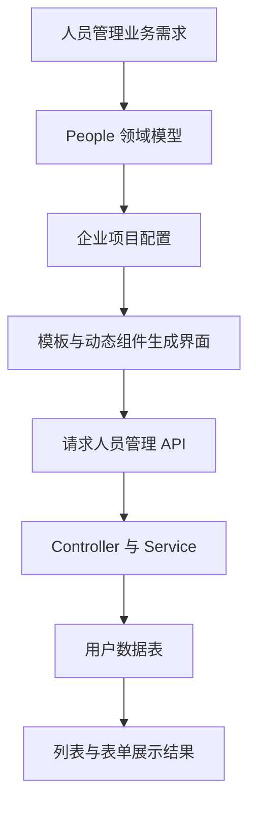
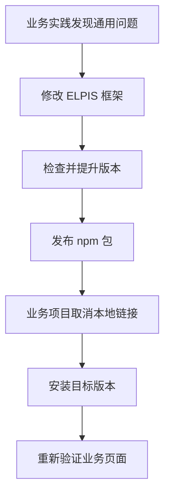

# 人员管理模块

<MuxPlayer
  className="mt-8"
  playbackId="UpT7pqSuS2fVDZcHkE00u9PSasHlz8ZRd2HvIvfSCvFo"
  title="人员管理模块"
/>

> [!NOTE]
>
> 本节把已经发布的 ELPIS 框架用到一个具体业务中：**人员管理模块**。先通过领域模型配置列表、搜索、创建、编辑与详情，再补齐服务端的增删改查接口。
>
> 实践过程中还会反向发现框架需要改进的地方，例如详情长文本的展示，以及业务侧扩展 Textarea 表单组件。最后再把框架改动发布为新版本，取消本地链接，验证业务项目能否使用真正安装的 npm 包。
>
> 本节的目标是跑通一类完整业务需求，展示框架的使用与迭代方式；不把这一个演示模块当成已经完善的企业人员权限系统。

## 从框架作者变成业务开发者

前两节已经为演示项目建立数据库、登录、登录态检查与登出能力。现在继续在 `elpis-demo` 中开发人员管理。

与最初从零搭建页面不同，这次已经有模板引擎、SchemaTable、SchemaSearchBar 和动态表单，业务开发首先面对的是一份模型配置。



课堂选择一个菜单作为完整样例。掌握这一条从配置到接口的链路之后，其他常规管理模块可以按相同方式继续组织。

以下代码依据字幕中能够确认的步骤整理为示意，字段名采用统一的驼峰写法。它用于解释配置和数据契约，不是整个示例项目的源码复制。

## 建立 People 模型与企业项目

第一步，在模型目录中创建人员管理模型，再创建一个企业项目，引用这个模型。

模型负责人员管理的共性；项目负责企业名称、首页等具体配置。现在只有一个企业项目，并不妨碍后续再增加其他项目复用同一个模型。

```js filename="人员管理菜单结构示意" copy
const userMenu = {
  key: "user",
  name: "人员管理",
  menuType: "model",
  modelType: "schema",
  schemaConfig: {
    api: "/api/project/user",
    schema: {},
    tableConfig: {},
  },
}
```

这里选择 `schema` 模块，让已有 SchemaView 承接页面。`api` 指定这一模块请求的数据入口，后面服务端需要提供与前端约定对应的接口。

框架能生成界面，并不意味着数据接口也自动存在。先配页面，再实现接口，是本节清晰的两个阶段。

## 从用户数据表推导字段

课堂对照已经创建的用户表，整理出人员模块的数据字段：用户标识、账号、昵称、描述、性别和创建时间等。

这些字段既与数据库有关，也与前端展示有关。Schema 要明确类型和名称，再决定每个字段出现在哪些功能里。

| 字段 | 业务含义 | 主要使用位置 |
| --- | --- | --- |
| `userId` | 用户唯一标识 | 行定位、详情、编辑、删除 |
| `userName` | 账号 | 列表、搜索、创建 |
| `nickName` | 昵称 | 列表、搜索、创建、编辑 |
| `dsc` | 描述 | 创建、编辑、详情 |
| `sex` | 性别枚举 | 列表、搜索、创建、编辑 |
| `createTime` | 创建时间 | 列表和时间范围搜索 |

课堂还涉及密码字段，但它不应作为普通展示数据随列表或详情返回。配置里隐藏一列，只是界面选择，不等于接口已经保护了该字段。

这一区别在本节尤为重要：字幕中包含直接查看演示密码的操作，复盘保留其教学背景，但下面的展示与查询示例会限定公开字段，不把明文密码回显当作可复用的业务规范。

## 同一字段可以参与不同组件

ELPIS 的配置不是分别写一份表格字段、一份搜索字段、一份创建表单字段，而是在同一个 Schema 字段上配置不同用途的 Option。

```js filename="账号字段的配置示意" copy
const userName = {
  type: "string",
  label: "账号",
  tableOption: {
    width: 150,
  },
  searchOption: {
    comType: "input",
  },
  createFormOption: {
    comType: "input",
  },
}
```

有 `tableOption`，就参与列表；有 `searchOption`，就参与搜索；有创建或编辑表单对应配置，才进入相应表单。

账号在创建时需要填写，但更新时不允许随意改变，就可以不配置对应的编辑入口。用户 ID 和创建时间通常由服务端生成，也不应要求使用者在新增表单里填写。

这种“一个字段，多处消费”的结构，是前面领域模型与动态组件课程在业务中的具体应用。

## 配置列表展示

课堂先决定哪些字段作为表格列。

用户 ID 较长，因此给它固定宽度，并启用溢出提示；账号、昵称和性别使用适合的列宽；创建时间可以利用剩余空间。

```js filename="用户标识列配置示意" copy
const userId = {
  type: "string",
  label: "用户 ID",
  tableOption: {
    width: 250,
    showOverflowTooltip: true,
  },
}
```

字段存在于数据结构中，不代表一定要展示成表格列。例如长描述更适合进入详情或编辑表单，列表只呈现便于扫描的信息。

表格展示范围还应与服务端返回范围配套。前端没有显示的敏感数据，并不会因此从网络响应中消失。

## 搜索项与“全部”选项

人员列表支持按账号、昵称、性别和创建时间筛选。

账号和昵称采用输入框，性别采用 Select，创建时间采用日期范围组件。

性别搜索额外有一个“全部”选项。课堂用 `-999` 表示不按性别限制，这个值是前后端共同约定的哨兵值，不是真实的业务性别。

```js filename="性别搜索选项示意" copy
const options = [
  { label: "全部", value: -999 },
  { label: "男", value: 1 },
  { label: "女", value: 2 },
]
```

服务端看到“全部”，应该不添加性别过滤条件。若直接把 `-999` 写进数据库查询条件，就会得到错误的空结果。

日期范围也要注意参数转换。页面上是一个范围选择器，请求时则按照框架组件约定拆成开始与结束两个字段，例如 `createTime_start`、`createTime_end`。

这些参数最终都要进入接口的 Query Schema，保持前端配置、请求封装和服务端读取位置一致。

## 配置表头和行操作

除了字段 Option，还要在 `tableConfig` 中描述整个表格的操作按钮。

表头放“新增用户”；行内放“查看详情”“修改”和“删除”。前面实现的事件分发机制会根据按钮的事件键决定触发什么行为。

| 按钮位置 | 操作 | 交互目标 |
| --- | --- | --- |
| 表头 | 新增用户 | 打开 CreateForm |
| 行内 | 查看详情 | 打开 DetailPanel |
| 行内 | 修改 | 打开 EditForm |
| 行内 | 删除 | 执行当前行的删除事件 |

新增没有当前行，编辑、详情和删除则需要当前行数据。因此不能只配置一个按钮名称，还要把事件目标和数据传递约定配好。

课堂中组件名称拼错时，动态组件查找失败。修正 `createForm` 等标识后，配置才能对应到实际注册的组件。

## 创建、编辑和详情各自的边界

创建表单收集新账号、昵称、描述和性别等用户输入。用户 ID 和初始密码由服务端生成，不让前端随意决定。

编辑表单则以 `userId` 为 `mainKey`，定位要更新的记录，只允许修改昵称、描述和性别等字段。创建时间也不是编辑内容。

详情面板同样需要 `mainKey`。它从当前行获取用户 ID，再通过详情接口读取对应记录，而不是假定表格行已经包含所有详情数据。


本节曾因没有配置 DetailPanel 本身而无法打开面板。仅在字段上写 `detailPanelOption` 还不够，还需要面板级配置提供标识、标题和主键约定。

## 页面完成后，接口还需要实现

完成 DSL 配置并启动后，表格、搜索和动态表单可以出现，但列表请求尚未得到真实数据。

此时页面在 Network 中发出 `/api/project/user/list` 一类请求，服务端必须补上相应接口。

课堂依次准备 Router Schema、Router、Controller 和 Service。前面的登录功能已经有用户 Service，可以在这一层继续增加人员管理方法。

```text filename="人员模块的服务端分层示意" copy
app/
├── router-schema/user.js
├── router/user.js
├── controller/user.js
└── service/user.js
```

这里不要把配置引擎的作用夸大为“配完就不需要后端”。框架复用了页面结构和请求约定，业务数据的读取、修改和约束仍要在服务端实现。

## 定义列表参数

人员列表接口接收筛选条件与分页参数。

```text filename="列表请求参数" copy
userName
nickName
sex
createTime_start
createTime_end
page
size
```

这些值来自 Query，所以分页参数往往是字符串。Controller 应先转换并检查，再交给数据库查询逻辑。

```js filename="分页参数整理示意" copy
const page = Number(ctx.query.page || 1)
const size = Number(ctx.query.size || 10)

if (!Number.isInteger(page) || page < 1 ||
    !Number.isInteger(size) || size < 1) {
  this.fail(ctx, "分页参数不合法", 40002)
  return
}
```

示例补充了基础范围判断，避免把无效偏移或数量带进数据库。课程的核心动作是把 Query 值转为后续查询可用的数值。

Router Schema 可以先检查参数结构，Controller 则负责组织业务参数。不能因为有前端表单校验，就省略服务端的处理。

## 列表数据与总数是两项结果

表格不仅需要当前页的数据，还需要符合筛选条件的总条数，才能计算分页。

例如数据库里有 100 条符合条件的数据，请求第一页、每页 10 条，那么响应列表应包含 10 条，`total` 则是 100。

`total` 不是当前页数组的长度，也不是整个用户表不带筛选条件的总数。

课程在 Service 中分别提供列表查询与总数查询，再在 Controller 中组合结果。两项查询相互独立，可以并行执行：

```js filename="Controller 并行读取列表与总数" copy
const [list, total] = await Promise.all([
  userService.getList({ ...filters, page, size }),
  userService.getListTotal(filters),
])

this.success(ctx, list, { total })
```

这里沿用课程统一返回方法，将列表作为主数据，总数作为附加信息。客户端必须按前面请求封装的结构读取 `data` 和 `metadata.total`，具体字段嵌套要与 BaseController 一致。

两个查询应使用相同的筛选条件；只有列表查询增加分页限制。否则页码显示与实际行数就会对不上。

## 把页码换算为数据库偏移

数据库查询中的 `offset` 表示跳过多少条记录，`limit` 表示最多取多少条。前端传来的是第几页和每页多少条，需要先做换算。

```js filename="分页换算" copy
const offset = (page - 1) * size
```

| page | size | offset | 含义 |
| --- | --- | --- | --- |
| 1 | 5 | 0 | 从第一条开始取 5 条 |
| 2 | 5 | 5 | 跳过前 5 条，再取 5 条 |
| 3 | 5 | 10 | 跳过前 10 条，再取 5 条 |

课堂用 Knex 风格的查询构建器组织用户表查询。以下示例强调分页和字段选择，表名、字段映射以实际建表结果为准：

```js filename="Service 列表查询示意" copy
const rows = await app.database("t_user")
  .select("userId", "userName", "nickName", "dsc", "sex", "createTime")
  .where({ status: 1 })
  .orderBy("createTime", "desc")
  .orderBy("userId", "asc")
  .limit(size)
  .offset((page - 1) * size)
```

示例增加稳定排序和显式公开字段，便于理解分页结果的边界。查询条件通过构建器传入，不把用户输入直接拼成 SQL 字符串。

## 筛选条件如何进入查询

课堂根据传入值逐项构造条件：有账号则增加账号条件，有昵称则增加昵称条件，性别需要转换并处理“全部”，时间范围则形成相应的起止条件。

这个过程不宜只用简单的真假值判断所有字段。空字符串、数值零、未传字段和“全部”各有不同含义，应按照每个字段约定处理。

字幕在部分查询实现区间出现重复文本，无法可靠还原全部过滤代码，因此这里不把未确认的匹配方式写成课程定论。账号、昵称是精确匹配还是模糊匹配，应以实际接口约定为准。

列表和总数查询都需要应用相同条件，特别是逻辑删除的状态筛选。数据查询只看有效用户，而计数包含已删除用户，就会产生多余页码。

## Controller 整理展示数据

从数据库取回的结果不一定适合直接放到表格里。例如性别在数据库里是枚举值，时间可能需要格式化。

课程在 Controller 中把它们转换为便于前端展示的内容，并借此强调分层：Service 更贴近数据读取，Controller 更贴近当前业务响应。

```js filename="列表展示数据整理示意" copy
const displayList = list.map((item) => ({
  ...item,
  sexText: item.sex === 1 ? "男" : item.sex === 2 ? "女" : "未知",
  createTimeText: moment(item.createTime).format("YYYY-MM-DD HH:mm:ss"),
}))
```

课堂直接调整展示字段；上面的复盘示例保留原值并增加展示字段，以便说明编辑回填与列表显示的区别。若采用这种结构，DSL 也需要对应展示字段。

无论选择哪一种形式，都要让列表、详情和表单遵循清晰约定。把原枚举值替换成展示文字以后，再直接塞回期待数字的 Select，就会造成编辑选项无法匹配。

## 查询单条用户与主键传递

详情接口根据 `userId` 查找单条用户。

查询构建器返回的结果即使只有一条，也可能仍是数组。Service 需要取出单条记录，再由 Controller 按详情接口结构返回。

```js filename="单条数据读取示意" copy
const user = await app.database("t_user")
  .select("userId", "userName", "nickName", "dsc", "sex", "createTime")
  .where({ userId, status: 1 })
  .first()

return user || null
```

本节字幕中使用查询结果第一项来实现相同目的。示例用 `first()` 表达“取单条”的意图。

整个主键链路是：表格行 → `mainKey` → 详情组件请求 → Controller → Service → 数据表。任意一层名称不一致，都可能造成面板打开但没有数据。

## 长文本反向推动框架改进

查看详情后，课堂发现用户 ID 太长，影响面板布局。

这不是某一个接口的数据错误，而是详情组件对长文本的处理不足，因此需要回到 ELPIS 框架里的 DetailPanel 调整公共样式。

```css filename="详情值区域样式示意" copy
.item-value {
  display: block;
  max-width: 250px;
  overflow: hidden;
  white-space: nowrap;
  text-overflow: ellipsis;
}
```

省略号需要宽度约束、溢出隐藏和单行不换行共同配合。只写 `text-overflow`，并不会自动解决布局问题。

课堂用这个小问题说明，框架发布不是结束。真实业务会不断暴露新的边界，通用问题回到框架修，业务差异留给扩展机制承接。

## 新增用户的服务端流程

新增使用 POST 请求，Controller 从 `ctx.request.body` 读取账号、昵称、描述与性别，交给 Service 创建用户。

Service 除了保存表单数据，还要补齐由后端负责的字段。课堂使用 UUID 工具生成用户 ID，并用随机密码工具生成初始密码，同时记录创建时间。


复盘时必须把身份标识和密码区分开：UUID 用来识别用户，不是登录凭证。随机生成初始密码也不等于已经解决密码存储安全，实际账号系统应采用专门的密码哈希存储机制，不能沿用演示中的明文保存与详情展示。

本节重点在创建链路，因此不扩写课程未实现的密码分发、强制修改和完整账户策略。

## 数据库为什么拒绝插入

新增联调时，课堂先修复了几个代码层问题，例如漏逗号、UUID 方法没有正确调用，以及时间工具变量名错误。

随后出现数据库错误：`status` 字段没有默认值，而且不允许为空，但插入数据里没有提供它。

这类错误不能靠前端重复点击解决，需要回到数据表约束和 Service 的写入对象。

| 数据表约束 | 插入时的要求 |
| --- | --- |
| 字段允许为空 | 可以按业务约定省略或填空 |
| 字段有默认值 | 省略时由数据库使用默认值 |
| 不可为空且无默认值 | 写入时必须提供合法值 |

课堂为新用户补上正常状态值后，创建成功。然后同时检查列表和数据库，确认不是只弹出成功提示，而是确实写入了一条记录。

这个验证方式很有用：新增后列表出现、详情可读、数据库存在，对应展示、读取和持久化三个环节。

## 用业务扩展增加 Textarea

人员描述较长，单行 Input 不适合输入。课堂借这个需求演示业务侧如何扩展 SchemaForm 组件。

做法是按照框架约定的扩展目录提供 Textarea 实现，并注册到组件映射中，再把描述字段的组件类型指向它。

实现可以参考已有 Input：继续接受框架传入的值、配置和事件，再把底层输入组件切换为 `textarea`，设置默认行数。

```vue filename="Textarea 内部输入结构示意" copy
<el-input
  type="textarea"
  :rows="5"
  :model-value="value"
  @update:model-value="onValueChange"
/>
```

这里的 `value`、`onValueChange` 应接到 SchemaForm 已有的值和事件协议，不是随意新建一套数据流。

课堂一度把文件建到了错误目录，纠正到组件扩展位置后才生效。动态组件找不到时，除了检查配置名称，也要检查文件是否进入了正确的扫描和注册范围。

新增表单变成多行输入，并能把填写内容存入数据库，才算验证了“配置 → 扩展组件 → 表单值 → API”的链路。

## 更新只允许指定字段

更新使用 PUT 请求，并要求携带 `userId`。Controller 从 Body 中提取主键与允许更新的字段，再交给 Service。

课堂允许修改昵称、描述和性别，不修改账号与创建时间。Service 还会记录更新时间。

```js filename="更新对象的整理示意" copy
const updateData = {
  updateTime: moment().format("YYYY-MM-DD HH:mm:ss"),
}

if (nickName !== undefined) updateData.nickName = nickName
if (dsc !== undefined) updateData.dsc = dsc
if (sex !== undefined) updateData.sex = Number(sex)

await app.database("t_user")
  .where({ userId, status: 1 })
  .update(updateData)
```

示例使用是否传入来判断，而不是 `if (dsc)`。否则用户想把描述清空时，空字符串会被忽略，旧内容就一直保留。

也不能把整个请求体直接写入数据库。前端不展示某个编辑框，不等于请求方无法提交这个字段；服务端仍要选择允许修改的内容。

课堂通过修改描述、昵称和性别，再打开详情确认结果，完成这一阶段验证。

## 删除采用状态更新

删除接口使用 DELETE 方法，但数据库层并没有直接删除物理记录，而是把 `status` 改为 `-1`。

```js filename="逻辑删除示意" copy
await app.database("t_user")
  .where({ userId, status: 1 })
  .update({
    status: -1,
    updateTime: moment().format("YYYY-MM-DD HH:mm:ss"),
  })
```

因此用户看到的“删除成功”，来自两个动作配合：写入时修改状态，读取时只查询正常状态。


课堂在数据库里确认记录仍然存在、状态已经变化，再回到页面确认列表不再显示它。这是逻辑删除与物理删除的直观区别。

更新和删除都必须校验 `userId`。主键缺失时不能继续执行一个范围不明的写入操作。

## 联调后再检查接口契约

完成 CRUD 后，可以用一条业务链路回查框架与接口是否配套：创建一个用户，确认列表出现；按条件筛选并切换分页；打开详情；修改字段并再次查看；删除后确认列表与详情查询不再返回有效记录。

这里同时检查了几个容易遗漏的约定：

- 列表数据和总数使用相同筛选条件。
- `mainKey` 对应真实返回的 `userId`。
- 创建、修改和删除的请求方法及参数位置一致。
- 修改允许清空的字段时，服务端不会错误忽略输入。
- 逻辑删除后，列表、计数和单条查询都遵守状态条件。

这组检查比单看“每个按钮能点开”更能证明业务链路已经接通。

## 框架更新后重新发布

本节同时修改了框架和业务项目。DetailPanel 等通用能力的变化需要回到框架仓库提交并发布，业务项目再更新依赖。

课堂把演示版本从 `1.0.4` 升到 `1.0.5`，发布后取消本地 npm link，并重新安装包，确认 `node_modules` 中实际使用的新版本。

这些版本号是课堂当时的演示记录，继续开发时应使用自己的版本序列。



本地链接能帮助联调，但它可能掩盖发布包缺文件、路径错误或版本未更新等问题。因此最后必须回到普通依赖安装方式检查。

课堂还遇到了安装网络等待，并在重新安装后查看包版本，再回到人员页面检查功能。笔记不把这些等待过程当作实现步骤，保留的是“确认真正使用了发布产物”这一验证目的。

## 关于最后的线上检查

视频最后进入云容器服务查看已有的公开入口，但字幕没有提供新版本已经在线上完整验证成功的结论。

因此本节能明确整理的结果，是本地业务模块的 CRUD 联调、框架更新、发布包版本检查与页面复验。线上是否部署了本次版本，还应结合前面 CI/CD 流水线和运行实例继续确认。

不要把“打开了云平台控制台”当作“新版本部署已经完成”，也不要把源码更新与正在运行的镜像版本混为一谈。

## 本节小结

本节用人员管理把整套框架串起来：模型配置决定菜单、列表、搜索和动态表单，服务端接口承担真实数据的增删改查，数据库提供持久化。

过程中，长文本展示和 Textarea 需求又推动框架与业务扩展继续完善。最后通过发布新版本、取消本地链接和重新安装，检查业务是否确实能消费框架产物。

这一节展示的价值，是常规界面可以复用稳定配置和组件，把开发精力集中到数据契约、业务约束以及真正需要定制的地方。框架会随着真实需求继续演进，人员管理就是一次完整的应用检验。
